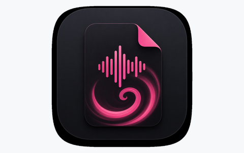
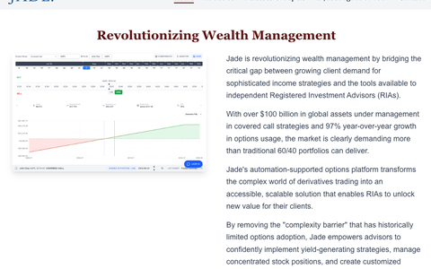

---

## Skills

<!-- SKILLS:START -->
### Languages

### Frameworks

### UI Libraries

### Tools

### Platform

### Cloud & DevOps

#### AWS

### Databases

### AI & Agentic

### Libraries & Data

<!-- SKILLS:END -->

## Projects

<!-- PROJECTS:START -->
<table width="100%">
<tr><td align="center" bgcolor="#f6f8fa">

  
<b><a href="https://github.com/roganhope/maiscribe">Maiscribe</a></b>
 
Meaning "My AI Scribe", an early stage open source project for free and accessible use for audio file transcription, speaker diarization and AI summarization.
</td></tr>
</table>

<table width="100%">
<tr><td align="center" bgcolor="#f6f8fa">

  
<b><a href="https://thejadeplatform.com/">The Jade Platform</a></b>
 
Served as lead engineer at Jade to engineer an options strategy management application for wealth management firms.
</td></tr>
</table>

<table width="100%">
<tr><td align="center" bgcolor="#f6f8fa">

  
<b><a href="https://sehreats.com">Sehr Eats</a></b>
 
My personal food blog for Armenian and Middle Eastern recipes, preserving culture & family recipes.
</td></tr>
</table>

<table width="100%">
<tr><td align="center" bgcolor="#f6f8fa">

  
<b><a href="https://bikersoutfiter.com">Biker's Outfitters Website</a></b>
 
An e-commerce platform I was contracted to build for Biker's Outfitters, a family-owned motorcycle dealership.
</td></tr>
</table>

<!-- PROJECTS:END -->

